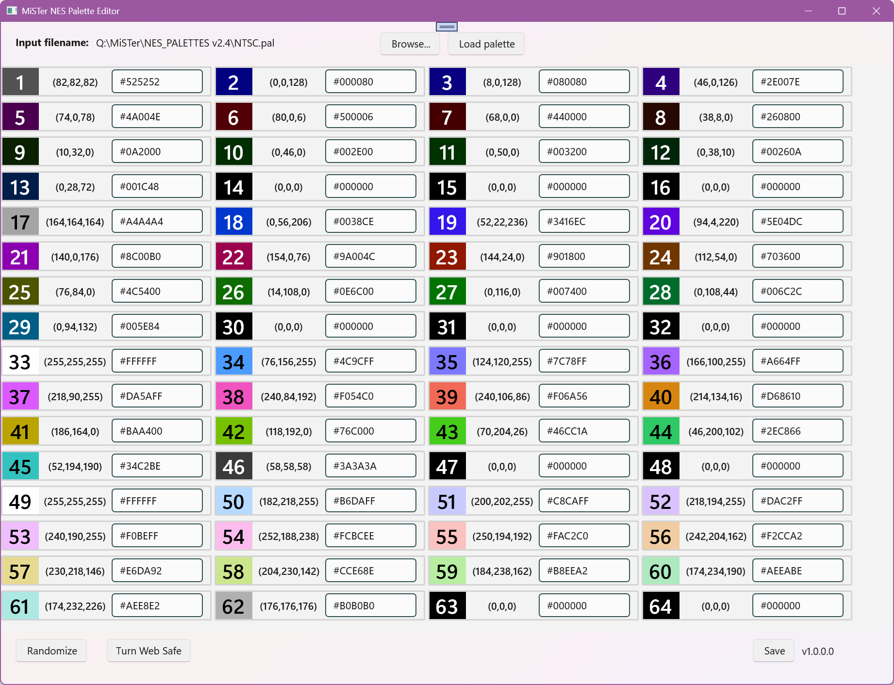

# MiSTer NES Palette Editor

An editor for MiSTer NES palette files. This is a Windows app built in C# with .NET 8 and WinUI. It can read .pal files and display the hex contents in a grid as color swatches and HTML hex color codes for editing and subsequent saving.

## Screenshots

## Installation

- Pre-Requisite: .NET 8 Desktop Runtime installed. Probably already installed with Windows. Install it from  if the app will not start. 
- Run .EXE (no further installation required)

Copy the extracted folder to your desired location and run the .EXE file.

## Usage

Browse for a .pal file, then load.

Edit it as needed, then save. The file you loaded from will be overwritten.

Transfer the file to your MiSTer and load in the NES core.

## Licensing

- Source and Releases: [MIT](LICENSE.txt)

## Roadmap

This application is currently considered feature-complete and stable. No features are on the roadmap, though it may be updated if necessary.

## Authors

[@natealism](https://bsky.app/profile/natealism.bsky.social)

## Acknowledgements

* The MiSTer Community
